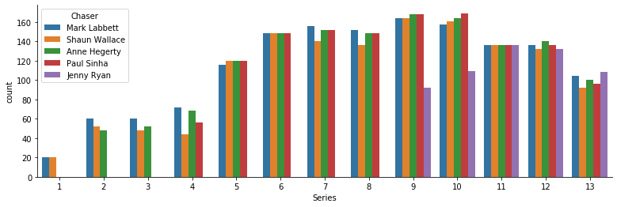
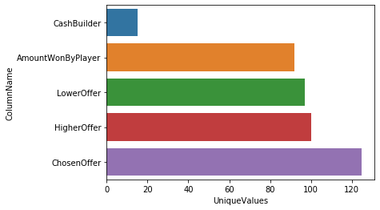
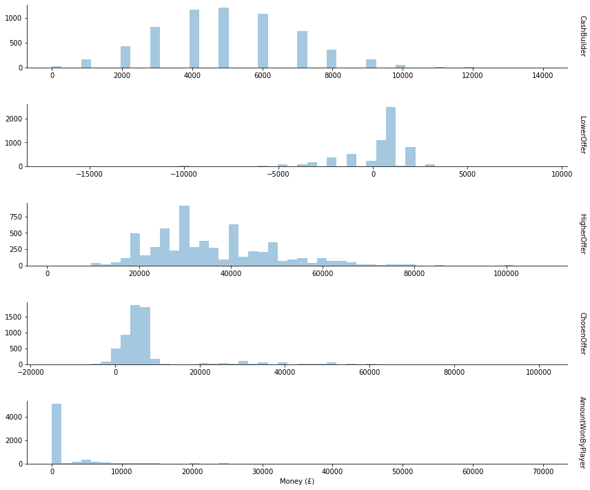

You might be familiar with hit British game show [The Chase](https://en.wikipedia.org/wiki/The_Chase_(British_game_show)). The key idea is that each show there are four contestants who each amass a sum of money by answering rapid fire questions, before going head to head against a quiz pro in order to try to add that money to the team's collective prize fund.


The interesting part is that before going head to head the contestant is given three offers. They can go high, low, or stick with what they've earned. Going high means potentially winning more money but gives them less of a head start, meaning they have to get more questions correct while getting fewer wrong. Conversely, going low gives an additional head start but means winning less money (potentially even subtracting from the existing prize fund).


Recently while watching, I was struck by the thought: if you pause at the moment the player chooses an offer, is it possible to predict how much money they will earn?


The show has been running since 2009, producing a total of 13 series. All of which has been so helpfully collated and analysed on the site [OneQuestionShootout.xyz](http://onequestionshootout.xyz/index.html), without which this analysis would have not have existed. So let's get started.


```python
import pandas as pd
import numpy as np
import matplotlib.pyplot as plt
import seaborn as sns

dfs = []
for i in range(13):
    # Read in the data, updated as of 2020-03-20
    df = pd.read_csv("data/players_series_" + str(i+1) + "_data_raw.csv")
    # Create a column containing the series
    df["Series"] = i+1
    dfs.append(df)

# Concatenate all of the dfs into a single df
df = pd.concat(dfs, ignore_index=True)
```

I've collated all of the [player data](http://onequestionshootout.xyz/players/series_all.htm) into a single dataframe and added a column for Series. Let's take a look.


```python
display(df.head())
print("\n" +"shape = " + str(df.shape))
print("\n" + "info =")
print(df.info())
```


<div>
<style scoped>
    .dataframe tbody tr th:only-of-type {
        vertical-align: middle;
    }

    .dataframe tbody tr th {
        vertical-align: top;
    }

    .dataframe thead th {
        text-align: right;
    }
</style>
<table border="1" class="dataframe">
  <thead>
    <tr style="text-align: right;">
      <th></th>
      <th>Date</th>
      <th>PlayerNo.</th>
      <th>Name</th>
      <th>CashBuilder</th>
      <th>Chaser</th>
      <th>LowerOffer</th>
      <th>HigherOffer</th>
      <th>ChosenOffer</th>
      <th>HTHResult</th>
      <th>FC CorrectAnswers</th>
      <th>FC Winner</th>
      <th>Amount WonBy Player</th>
      <th>bgc</th>
      <th>Series</th>
    </tr>
  </thead>
  <tbody>
    <tr>
      <th>0</th>
      <td>29/06/2009</td>
      <td>P1</td>
      <td>Lisa</td>
      <td>£5,000</td>
      <td>Mark Labbett</td>
      <td>£2,000</td>
      <td>£10,000</td>
      <td>£2,000 \/</td>
      <td>Caught -1</td>
      <td>NaN</td>
      <td>Chaser by 0:07</td>
      <td>£0</td>
      <td>NaN</td>
      <td>1</td>
    </tr>
    <tr>
      <th>1</th>
      <td>29/06/2009</td>
      <td>P2</td>
      <td>Ian</td>
      <td>£7,000</td>
      <td>Mark Labbett</td>
      <td>£2,000</td>
      <td>£20,000</td>
      <td>£20,000 /\</td>
      <td>Home +1</td>
      <td>1 (team 2)</td>
      <td>Chaser by 0:07</td>
      <td>£0</td>
      <td>C</td>
      <td>1</td>
    </tr>
    <tr>
      <th>2</th>
      <td>29/06/2009</td>
      <td>P3</td>
      <td>Claire</td>
      <td>£8,000</td>
      <td>Mark Labbett</td>
      <td>£2,000</td>
      <td>£20,000</td>
      <td>£8,000 =</td>
      <td>Caught -3</td>
      <td>NaN</td>
      <td>Chaser by 0:07</td>
      <td>£0</td>
      <td>NaN</td>
      <td>1</td>
    </tr>
    <tr>
      <th>3</th>
      <td>29/06/2009</td>
      <td>P4</td>
      <td>Driss</td>
      <td>£9,000</td>
      <td>Mark Labbett</td>
      <td>£200</td>
      <td>£20,000</td>
      <td>£200 \/</td>
      <td>Home +5</td>
      <td>15 (team 2)</td>
      <td>Chaser by 0:07</td>
      <td>£0</td>
      <td>C</td>
      <td>1</td>
    </tr>
    <tr>
      <th>4</th>
      <td>30/06/2009</td>
      <td>P1</td>
      <td>Bradley</td>
      <td>£8,000</td>
      <td>Shaun Wallace</td>
      <td>£4,000</td>
      <td>£16,000</td>
      <td>£8,000 =</td>
      <td>Home +1</td>
      <td>14 (team 3)</td>
      <td>Chaser by 0:02</td>
      <td>£0</td>
      <td>C</td>
      <td>1</td>
    </tr>
  </tbody>
</table>
</div>


    shape = (6224, 14)

    info =
    <class 'pandas.core.frame.DataFrame'>
    RangeIndex: 6224 entries, 0 to 6223
    Data columns (total 14 columns):
     #   Column               Non-Null Count  Dtype
    ---  ------               --------------  -----
     0   Date                 6224 non-null   object
     1   PlayerNo.            6224 non-null   object
     2   Name                 6224 non-null   object
     3   CashBuilder          6224 non-null   object
     4   Chaser               6224 non-null   object
     5   LowerOffer           6224 non-null   object
     6   HigherOffer          6224 non-null   object
     7   ChosenOffer          6224 non-null   object
     8   HTHResult            6224 non-null   object
     9   FC CorrectAnswers    3751 non-null   object
     10  FC Winner            6224 non-null   object
     11  Amount WonBy Player  6224 non-null   object
     12  bgc                  3886 non-null   object
     13  Series               6224 non-null   int64
    dtypes: int64(1), object(13)
    memory usage: 680.9+ KB
    None


Okay, let's make some quick observations.

For our purposes, the following columns contain no useful information and can be safely dropped:
- Name
- FC CorrectAnswers
- FC Winner
- bgc

Outside of the dropped columns, there are no null values, great!

For convenience, we will make the following alterations:
- Rename the columns into title case (e.g. FooBar).
- Drop the 'P' prefix from the values in the 'PlayerNo.' column.
- Format all of the values in the 'Date' column into datetime.
- Simplify the 'HTHResult' column to contain '0' if the contestant was caught, and '1' otherwise.


```python
# Drop the unused columns
unused_cols = ["Name", "FC CorrectAnswers", "FC Winner", "bgc"]
df.drop(columns=unused_cols, inplace=True, axis=1)

# Rename the columns to title case without spaces
df.rename(columns={"PlayerNo.": "PlayerNumber",
                   "Amount WonBy Player": "AmountWonByPlayer"}, inplace=True)

# Format the 'Date' column
df["Date"] = pd.to_datetime(df["Date"], format="%d/%m/%Y")

# Format the 'PlayerNumber' column
df["PlayerNumber"] = df["PlayerNumber"].str.replace(r"P", "").astype('int')

# Format 'HTHResult' column such that it contains 0 if the player was caught and 1 otherwise
# Convert data type to int
df["HTHResult"] = df["HTHResult"].str.replace(r"Caught.*", "0")
df["HTHResult"] = df["HTHResult"].str.replace(r"Home.*", "1").astype('int')

display(df.head())
```


<div>
<style scoped>
    .dataframe tbody tr th:only-of-type {
        vertical-align: middle;
    }

    .dataframe tbody tr th {
        vertical-align: top;
    }

    .dataframe thead th {
        text-align: right;
    }
</style>
<table border="1" class="dataframe">
  <thead>
    <tr style="text-align: right;">
      <th></th>
      <th>Date</th>
      <th>PlayerNumber</th>
      <th>CashBuilder</th>
      <th>Chaser</th>
      <th>LowerOffer</th>
      <th>HigherOffer</th>
      <th>ChosenOffer</th>
      <th>HTHResult</th>
      <th>AmountWonByPlayer</th>
      <th>Series</th>
    </tr>
  </thead>
  <tbody>
    <tr>
      <th>0</th>
      <td>2009-06-29</td>
      <td>1</td>
      <td>£5,000</td>
      <td>Mark Labbett</td>
      <td>£2,000</td>
      <td>£10,000</td>
      <td>£2,000 \/</td>
      <td>0</td>
      <td>£0</td>
      <td>1</td>
    </tr>
    <tr>
      <th>1</th>
      <td>2009-06-29</td>
      <td>2</td>
      <td>£7,000</td>
      <td>Mark Labbett</td>
      <td>£2,000</td>
      <td>£20,000</td>
      <td>£20,000 /\</td>
      <td>1</td>
      <td>£0</td>
      <td>1</td>
    </tr>
    <tr>
      <th>2</th>
      <td>2009-06-29</td>
      <td>3</td>
      <td>£8,000</td>
      <td>Mark Labbett</td>
      <td>£2,000</td>
      <td>£20,000</td>
      <td>£8,000 =</td>
      <td>0</td>
      <td>£0</td>
      <td>1</td>
    </tr>
    <tr>
      <th>3</th>
      <td>2009-06-29</td>
      <td>4</td>
      <td>£9,000</td>
      <td>Mark Labbett</td>
      <td>£200</td>
      <td>£20,000</td>
      <td>£200 \/</td>
      <td>1</td>
      <td>£0</td>
      <td>1</td>
    </tr>
    <tr>
      <th>4</th>
      <td>2009-06-30</td>
      <td>1</td>
      <td>£8,000</td>
      <td>Shaun Wallace</td>
      <td>£4,000</td>
      <td>£16,000</td>
      <td>£8,000 =</td>
      <td>1</td>
      <td>£0</td>
      <td>1</td>
    </tr>
  </tbody>
</table>
</div>


The categorical columns look straightforward enough, let's do a brief investigation.


```python
# Initialize list of categorical column names
cat_cols = ["PlayerNumber", "Chaser", "HTHResult", "Series"]

# Plot counplots
df_cat_melt = pd.melt(df[cat_cols])
g = sns.FacetGrid(df_cat_melt,
                  row="variable",
                  despine=True,
                  aspect=6,
                  height=2,
                  sharey=False,
                  sharex=False,
                  margin_titles=True,)
g.map(sns.countplot, "value")

# Clear the existing plot titles and set them appropriately
for ax in g.axes.flat:
    plt.setp(ax.texts, text="")
g.set_titles(row_template="{row_name}")

plt.show()
```

    C:\Users\Avery\anaconda3\lib\site-packages\seaborn\axisgrid.py:728: UserWarning: Using the countplot function without specifying `order` is likely to produce an incorrect plot.
      warnings.warn(warning)


Nothing too unusual here.

Each game has four contestants, so we get the expected uniform distribution of player numbers.

The chasers are roughly uniformly distributed, except for Jenny Ryan. We'll return to this shortly.

The HTHResult skews in favour of the contestants, i.e. the majority of contestants win their head to head round. This isn't too surprising, since the show gives the chasers a reasonable handicap. More analysis could be done here, but we'll save that for a later date.

Lastly we see the number of contestants per series has roughly increased. Since there are always four contestants per episode and the number of episodes per series has increased over time, which I'd reasonably expect to be the result of the show gaining traction and popularity over time. There is a notable dip at series thirteen, simply because it's still airing.

Now, returning back to the chasers.


```python
# Find the first occurrence of each chaser in the data
df_chaser = df[["Date", "Chaser", "Series"]].drop_duplicates(subset="Chaser").reset_index()
display(df_chaser.head())

# Plot
plt.figure(figsize=(13,4))
sns.countplot(x="Series", hue="Chaser", data=df)
sns.despine()
plt.show()
```


<div>
<style scoped>
    .dataframe tbody tr th:only-of-type {
        vertical-align: middle;
    }

    .dataframe tbody tr th {
        vertical-align: top;
    }

    .dataframe thead th {
        text-align: right;
    }
</style>
<table border="1" class="dataframe">
  <thead>
    <tr style="text-align: right;">
      <th></th>
      <th>index</th>
      <th>Date</th>
      <th>Chaser</th>
      <th>Series</th>
    </tr>
  </thead>
  <tbody>
    <tr>
      <th>0</th>
      <td>0</td>
      <td>2009-06-29</td>
      <td>Mark Labbett</td>
      <td>1</td>
    </tr>
    <tr>
      <th>1</th>
      <td>4</td>
      <td>2009-06-30</td>
      <td>Shaun Wallace</td>
      <td>1</td>
    </tr>
    <tr>
      <th>2</th>
      <td>56</td>
      <td>2010-05-28</td>
      <td>Anne Hegerty</td>
      <td>2</td>
    </tr>
    <tr>
      <th>3</th>
      <td>372</td>
      <td>2011-09-08</td>
      <td>Paul Sinha</td>
      <td>4</td>
    </tr>
    <tr>
      <th>4</th>
      <td>2972</td>
      <td>2015-09-02</td>
      <td>Jenny Ryan</td>
      <td>9</td>
    </tr>
  </tbody>
</table>
</div>





We can see that Mark, Shaun and Anne joined the show very early on with Paul following slightly later. While Jenny didn't appear until around 6 years into the show's lifespan during series nine. Hence over the entire lifespan of the show, simply the chasers who joined earlier have had more appearances. Though within each individual series, save for series 9 and 10, the chasers are roughly uniformly distributed.

But it's worth noting that due to the underlying data being formatted as rows of contestants, and since each show has four contestants, the counts above have effectively been multiplied by four - thereby making the variability between chasers seem much higher than it actually is.

The columns with cash amounts in them are more interesting, so let's examine those in detail.


```python
# Initialize list of numeric column names
num_cols = ["CashBuilder", "LowerOffer", "HigherOffer", "ChosenOffer", "AmountWonByPlayer"]

# Find the number of unique values in each numeric column
num_cols_nunique = df[num_cols].nunique().reset_index()
df_num_cols_nunique = pd.DataFrame(num_cols_nunique)
num_cols_nunique.columns = ["ColumnName", "UniqueValues"]
display(df_num_cols_nunique)

# Plot barplot
sns.barplot(x="UniqueValues",
            y="ColumnName",
            data=df_num_cols_nunique,
            order=df_num_cols_nunique.sort_values("UniqueValues")["ColumnName"])
plt.show()
```


<div>
<style scoped>
    .dataframe tbody tr th:only-of-type {
        vertical-align: middle;
    }

    .dataframe tbody tr th {
        vertical-align: top;
    }

    .dataframe thead th {
        text-align: right;
    }
</style>
<table border="1" class="dataframe">
  <thead>
    <tr style="text-align: right;">
      <th></th>
      <th>ColumnName</th>
      <th>UniqueValues</th>
    </tr>
  </thead>
  <tbody>
    <tr>
      <th>0</th>
      <td>CashBuilder</td>
      <td>15</td>
    </tr>
    <tr>
      <th>1</th>
      <td>LowerOffer</td>
      <td>97</td>
    </tr>
    <tr>
      <th>2</th>
      <td>HigherOffer</td>
      <td>100</td>
    </tr>
    <tr>
      <th>3</th>
      <td>ChosenOffer</td>
      <td>125</td>
    </tr>
    <tr>
      <th>4</th>
      <td>AmountWonByPlayer</td>
      <td>92</td>
    </tr>
  </tbody>
</table>
</div>





That's quite a lot of unique values! Clearly we'll have to investigate the values in these columns.


```python
# Print a list of the unique values in each numeric column
for col in num_cols:
    print(str(col) + " unique values:")
    print(df[col].unique())
    print("\n")
```

    CashBuilder unique values:
    ['£5,000' '£7,000' '£8,000' '£9,000' '£3,000' '£6,000' '£10,000' '£4,000'
     '£12,000' '£11,000' '£14,000' '£2,000' '£13,000' '£1,000' '£0']


    LowerOffer unique values:
    ['£2,000' '£200' '£4,000' '£1,000' '£3,000' '£400' '£1,500' '£500'
     '£5,000' '£100' '£300' '£150' '£240' '£800' '£38' '£26' '£10' '£747' '£1'
     '£600' '£700' '£2,500' '-£1,000' '£250' '-£2,000' '£50' '£3' '£4' '£999'
     '-£597' '£230' '-£500' '£40' '£88' '£0' '£30' '£2' '£5' '-£10,000'
     '-£4,000' '-£5,000' '£900' '-£9,000' '£6' '-£3,000' '£721' '-£8,000' '£9'
     '£80' 'no offer' '£21' '-£6,000' '-£300' '£25' '-£7,000' '-£99' '£3,500'
     '£60' '-£400' '£20' '£19' '£70' '-£11,000' '£666' '£1,200' '£350'
     '-£13,000' '-£2,300' '-£1' '£720' '-£200' '£1,881' '-£15,000' '£8,999'
     '-£999' '-£12,000' '-£1,997' '£84' '£458' '£7.99' '£55' '£501' '-£2,200'
     '£99' '2p' '-£3,999' '£19.99' '£369' '£2,012' '-£100' '£91' '£69' '£125'
     '1p' '-£17,000' '£241' '£550']


    HigherOffer unique values:
    ['£10,000' '£20,000' '£16,000' '£13,000' '£25,000' '£14,000' '£18,000'
     '£15,000' '£11,000' '£12,000' '£22,000' '£6,000' '£24,000' '£29,000'
     '£27,000' '£30,000' '£28,000' '£19,000' '£21,000' '£26,000' '£35,000'
     '£31,000' '£40,000' '£33,000' '£23,000' '£32,000' '£38,000' '£50,000'
     '£60,000' '£55,000' '£34,000' '£8,000' '£37,000' '£20,012' '£45,000'
     '£47,000' '£17,000' '£36,000' '£52,000' '£43,000' '£51,000' '£41,000'
     '£70,000' '£73,000' '£75,000' '£46,000' '£66,000' '£59,000' '£42,000'
     '£64,000' '£44,000' '£9,000' '£58,000' '£54,000' '£39,000' '£7,000'
     '£49,000' '£48,000' '£53,000' '£65,000' '£57,000' '£53,700' '£37,500'
     '£5,000' '£63,000' '£56,000' '£80,000' '£67,000' '£79,000' '£68,000'
     '£45,999' '£72,000' '£61,000' '£76,000' '£40,900' '£43,700' '£69,000'
     '£85,000' '£62,000' '£77,000' '£74,000' '£67,700' '£1,000' '£49,500'
     '£71,000' '£100,000' '£89,000' '£78,000' '£81,000' '£108,000' '£84,000'
     '£98,000' '£101,000' '£35,999' '£86,000' '£94,000' '£40,800' '£96,000'
     '£49,700' '£47,700']


    ChosenOffer unique values:
    ['£2,000 \\/' '£20,000 /\\' '£8,000 =' '£200 \\/' '£3,000 =' '£25,000 /\\'
     '£6,000 =' '£7,000 =' '£3,000 \\/' '£400 \\/' '£10,000 =' '£1,500 \\/'
     '£5,000 =' '£15,000 /\\' '£4,000 =' '£18,000 /\\' '£12,000 =' '£11,000 ='
     '£1,000 \\/' '£9,000 =' '£14,000 =' '£4,000 \\/' '£150 \\/' '£500 \\/'
     '£26,000 /\\' '£2,000 =' '£30,000 /\\' '£29,000 /\\' '£24,000 /\\'
     '£800 \\/' '£40,000 /\\' '£13,000 =' '£100 \\/' '£38,000 /\\'
     '£28,000 /\\' '£55,000 /\\' '£22,000 /\\' '£21,000 /\\' '-£2,000 \\/'
     '£16,000 /\\' '£3 \\/' '£300 \\/' '£10,000 /\\' '£1,000 =' '-£1,000 \\/'
     '£32,000 /\\' '£27,000 /\\' '£35,000 /\\' '£36,000 /\\' '£45,000 /\\'
     '£50,000 /\\' '£73,000 /\\' '£75,000 /\\' '£60,000 /\\' '£66,000 /\\'
     '-£500 \\/' '-£5,000 \\/' '£44,000 /\\' '-£9,000 \\/' '£1 \\/'
     '£49,000 /\\' '-£3,000 \\/' '£43,000 /\\' '£999 \\/' '£12,000 /\\'
     '£0 \\/' '£34,000 /\\' '£0 =' '£37,000 /\\' '£39,000 /\\' '-£4,000 \\/'
     '£46,000 /\\' '-£6,000 \\/' '£53,700 /\\' '£37,500 /\\' '-£7,000 \\/'
     '£31,000 /\\' '£600 \\/' '£54,000 /\\' '£42,000 /\\' '£33,000 /\\'
     '£52,000 /\\' '£65,000 /\\' '£48,000 /\\' '£47,000 /\\' '£51,000 /\\'
     '£50,000 =' '£72,000 /\\' '£23,000 /\\' '£56,000 /\\' '£41,000 /\\'
     '£40,900 /\\' '-£11,000 \\/' '£2 \\/' '£59,000 /\\' '£67,000 /\\'
     '£5 \\/' '£77,000 /\\' '-£13,000 \\/' '£58,000 /\\' '£80,000 /\\'
     '£57,000 /\\' '-£10,000 \\/' '£53,000 /\\' '£70,000 /\\' '£68,000 /\\'
     '-£15,000 \\/' '£8,999 \\/' '-£8,000 \\/' '£100,000 /\\' '£62,000 /\\'
     '£64,000 /\\' '£84,000 /\\' '£98,000 /\\' '£63,000 /\\' '£61,000 /\\'
     '£101,000 /\\' '£35,999 /\\' '£85,000 /\\' '£86,000 /\\' '£94,000 /\\'
     '£5,000 \\/' '£50 \\/' '£241 \\/' '£76,000 /\\']


    AmountWonByPlayer unique values:
    ['£0' '£5,500' '£4,000' '£11,000' '£4,750' '£10,250' '£4,600' '£7,333'
     '£8,000' '£11,333' '£7,500' '£2,333' '£20,000' '£4,800' '£14,000'
     '£7,000' '£12,600' '£5,667' '£5,000' '£10,000' '£4,767' '£12,500'
     '£20,500' '£6,000' '£17,000' '£3,667' '£11,750' '£25,000' '£3,000'
     '£8,667' '£8,333' '£13,000' '£4,667' '£10,333' '£15,000' '£7,750'
     '£2,000' '£5,750' '£9,750' '£60,000' '£1,000' '£30,000' '£10,500'
     '£4,500' '£4,333' '£4,250' '£3,500' '£5,333' '£6,500' '£11,500' '£21,000'
     '£4,666' '£9,000' '£40,000' '£3,333' '£50,000' '£3,625' '£16,500'
     '£9,500' '£6,667' '£3,750' '£3,033' '£4,433' '£2,334' '£21,500' '£5,250'
     '£5,075' '£13,667' '£15,500' '£13,333' '£2,667' '£8,750' '£6,250'
     '£6,750' '£12,000' '£6,333' '£2,500' '£26,500' '£20,333' '£8,500'
     '£23,000' '£1,575' '£11,250' '£3,400' '£12,333' '£13,750' '£9,667'
     '£70,000' '£7,667' '£7,250' '£4,017' '£10,667']


Thankfully the columns 'CashBuilder' and 'HighOffer' are straightforward. Problems arise in 'LowerOffer' with the values 'no offer', '1p', and '2p' as well as in 'ChosenOffer' with the various symbols obscuring the numerical data.

Let's start the cleanup by dropping all rows containing 'no offer'. I'm also going to drop any contestants who played in the same team as a contestant whose row was dropped i.e. drop any rows which share a date with a dropped row. So later on this allows us to consider information which relies on knowing everything that happened to the earlier contestants in a particular team.


```python
# Store initial df.shape
df_shape_start = df.shape

# Drop columns as specified
drop_cols = df[df["LowerOffer"].str.contains("no offer")]
drop_dates = drop_cols["Date"].unique()
df = df[~df["Date"].isin(drop_dates)].reset_index(drop=True)

# Store current df.shape
df_shape_end = df.shape

# Find difference and percentage change of rows
num_dropped_rows = df_shape_start[0] - df_shape_end[0]
percent_dropped_rows = 100 * num_dropped_rows / df_shape_start[0]

# Output results nicely formatted
print(df_shape_end)
print("Number of rows dropped: " + str(num_dropped_rows))
print("Percentage of rows dropped: " + str(percent_dropped_rows))
```

    (6192, 10)
    Number of rows dropped: 32
    Percentage of rows dropped: 0.5141388174807198


In total only 32 rows were lost (~0.51% of rows), which isn't overly troubling.

Now we can deal with those annoying pence values and remove all of the excess symbols.


```python
# Convert specific pence values to pounds
df["LowerOffer"].replace({"2p": "0.02", "1p": "0.01"})

# Recall num_cols = ["CashBuilder", "LowerOffer", "HigherOffer", "ChosenOffer", "AmountWonByPlayer"]
# Remove any non-numeric values and convert data type to float
for col in num_cols:
    df[col] = df[col].str.replace(r"[^0-9-]+", "").astype('float')

display(df.head())
```


<div>
<style scoped>
    .dataframe tbody tr th:only-of-type {
        vertical-align: middle;
    }

    .dataframe tbody tr th {
        vertical-align: top;
    }

    .dataframe thead th {
        text-align: right;
    }
</style>
<table border="1" class="dataframe">
  <thead>
    <tr style="text-align: right;">
      <th></th>
      <th>Date</th>
      <th>PlayerNumber</th>
      <th>CashBuilder</th>
      <th>Chaser</th>
      <th>LowerOffer</th>
      <th>HigherOffer</th>
      <th>ChosenOffer</th>
      <th>HTHResult</th>
      <th>AmountWonByPlayer</th>
      <th>Series</th>
    </tr>
  </thead>
  <tbody>
    <tr>
      <th>0</th>
      <td>2009-06-29</td>
      <td>1</td>
      <td>5000.0</td>
      <td>Mark Labbett</td>
      <td>2000.0</td>
      <td>10000.0</td>
      <td>2000.0</td>
      <td>0</td>
      <td>0.0</td>
      <td>1</td>
    </tr>
    <tr>
      <th>1</th>
      <td>2009-06-29</td>
      <td>2</td>
      <td>7000.0</td>
      <td>Mark Labbett</td>
      <td>2000.0</td>
      <td>20000.0</td>
      <td>20000.0</td>
      <td>1</td>
      <td>0.0</td>
      <td>1</td>
    </tr>
    <tr>
      <th>2</th>
      <td>2009-06-29</td>
      <td>3</td>
      <td>8000.0</td>
      <td>Mark Labbett</td>
      <td>2000.0</td>
      <td>20000.0</td>
      <td>8000.0</td>
      <td>0</td>
      <td>0.0</td>
      <td>1</td>
    </tr>
    <tr>
      <th>3</th>
      <td>2009-06-29</td>
      <td>4</td>
      <td>9000.0</td>
      <td>Mark Labbett</td>
      <td>200.0</td>
      <td>20000.0</td>
      <td>200.0</td>
      <td>1</td>
      <td>0.0</td>
      <td>1</td>
    </tr>
    <tr>
      <th>4</th>
      <td>2009-06-30</td>
      <td>1</td>
      <td>8000.0</td>
      <td>Shaun Wallace</td>
      <td>4000.0</td>
      <td>16000.0</td>
      <td>8000.0</td>
      <td>1</td>
      <td>0.0</td>
      <td>1</td>
    </tr>
  </tbody>
</table>
</div>


That should be the last bit of cleaning, the data looks much nicer. Let's take the opportunity to look at the distribution of the numerical columns.


```python
# Plot distplots
df_num_melt = pd.melt(df[num_cols], value_name="Money (£)")
g = sns.FacetGrid(df_num_melt,
                  row="variable",
                  despine=True,
                  aspect=6,
                  height=2,
                  sharey=False,
                  sharex=False,
                  margin_titles=True)
g.map(sns.distplot, "Money (£)", kde=False)

# Clear the existing plot titles and set them appropriately
for ax in g.axes.flat:
    plt.setp(ax.texts, text="")
g.set_titles(row_template="{row_name}")

plt.show()
```





The cash builder values only have positive values in multiples of £1000. During the cash builder round, contestants earn £1000 for each correct answer. So we expect this otherwise unusual shape.

Lower offers cluster around £1000, with quite a few negative values. In the show lower offers will always be no higher than what the contestant earned during the cash builder, and will always be no less than the total money currently earned by the team (which could be 0 if this contestant is the first player, or all earlier contestants were eliminated). So the range of possible values is actually quite constrained, which seems to be reflected in the data.

Higher offers seem to have a lot more variance with fewer clear patterns. The only constraint is that they will be no less than what the contestant earned during the cash builder, though they tend to be significantly higher. More patterns might emerge from different analysis later.

The chosen offers reflect a combination of the earlier columns, naturally since chosen offers will always be precisely one of either the cash builder, lower offer, or higher offer. Though it is interesting to note that the chosen offer clusters around the low thousands, suggesting that the majority of contestants choose to stick with their cash builder result rather than choosing the lower or higher offer.

The amount won by player indicates an especially unusual aspect of this data, that many contestants win nothing at all.

We can get a little more information out of this data. If we place ourselves back in the gameshow when the player has just chosen their offer, what information do they have access to that isn't represented by one of our columns?

- Whether the offer they chose was low, middle, or high.
- The number of players in their team who won their head to head round so far.
- The amount of money currently in their team's prize fund.

These should be fairly easy to obtain given our current data.


```python
# Find which offer the current player chose
def whichOffer(row):
    if row["ChosenOffer"] == row["HigherOffer"]:
        return "High"
    elif row["ChosenOffer"] == row["LowerOffer"]:
        return "Low"
    else:
        return "Mid"
df["WhichOffer"] = df.apply(whichOffer, axis=1)

# Find the number of players this game which made it home before the current player
cumsum_HTHResult = df.groupby("Date")["HTHResult"].cumsum()
df["PlayersHome"] = cumsum_HTHResult.sub(df["HTHResult"])

# Find the total money this game which made it home before the current player
prize_fund = df["ChosenOffer"] * df["HTHResult"]
cumsum_money = prize_fund.groupby(df["Date"]).cumsum()
df["PrizeTotal"] = cumsum_money.sub(prize_fund)

display(df.head())
print(df.info())
```


<div>
<style scoped>
    .dataframe tbody tr th:only-of-type {
        vertical-align: middle;
    }

    .dataframe tbody tr th {
        vertical-align: top;
    }

    .dataframe thead th {
        text-align: right;
    }
</style>
<table border="1" class="dataframe">
  <thead>
    <tr style="text-align: right;">
      <th></th>
      <th>Date</th>
      <th>PlayerNumber</th>
      <th>CashBuilder</th>
      <th>Chaser</th>
      <th>LowerOffer</th>
      <th>HigherOffer</th>
      <th>ChosenOffer</th>
      <th>HTHResult</th>
      <th>AmountWonByPlayer</th>
      <th>Series</th>
      <th>WhichOffer</th>
      <th>PlayersHome</th>
      <th>PrizeTotal</th>
    </tr>
  </thead>
  <tbody>
    <tr>
      <th>0</th>
      <td>2009-06-29</td>
      <td>1</td>
      <td>5000.0</td>
      <td>Mark Labbett</td>
      <td>2000.0</td>
      <td>10000.0</td>
      <td>2000.0</td>
      <td>0</td>
      <td>0.0</td>
      <td>1</td>
      <td>Low</td>
      <td>0</td>
      <td>0.0</td>
    </tr>
    <tr>
      <th>1</th>
      <td>2009-06-29</td>
      <td>2</td>
      <td>7000.0</td>
      <td>Mark Labbett</td>
      <td>2000.0</td>
      <td>20000.0</td>
      <td>20000.0</td>
      <td>1</td>
      <td>0.0</td>
      <td>1</td>
      <td>High</td>
      <td>0</td>
      <td>0.0</td>
    </tr>
    <tr>
      <th>2</th>
      <td>2009-06-29</td>
      <td>3</td>
      <td>8000.0</td>
      <td>Mark Labbett</td>
      <td>2000.0</td>
      <td>20000.0</td>
      <td>8000.0</td>
      <td>0</td>
      <td>0.0</td>
      <td>1</td>
      <td>Mid</td>
      <td>1</td>
      <td>20000.0</td>
    </tr>
    <tr>
      <th>3</th>
      <td>2009-06-29</td>
      <td>4</td>
      <td>9000.0</td>
      <td>Mark Labbett</td>
      <td>200.0</td>
      <td>20000.0</td>
      <td>200.0</td>
      <td>1</td>
      <td>0.0</td>
      <td>1</td>
      <td>Low</td>
      <td>1</td>
      <td>20000.0</td>
    </tr>
    <tr>
      <th>4</th>
      <td>2009-06-30</td>
      <td>1</td>
      <td>8000.0</td>
      <td>Shaun Wallace</td>
      <td>4000.0</td>
      <td>16000.0</td>
      <td>8000.0</td>
      <td>1</td>
      <td>0.0</td>
      <td>1</td>
      <td>Mid</td>
      <td>0</td>
      <td>0.0</td>
    </tr>
  </tbody>
</table>
</div>


    <class 'pandas.core.frame.DataFrame'>
    RangeIndex: 6192 entries, 0 to 6191
    Data columns (total 13 columns):
     #   Column             Non-Null Count  Dtype         
    ---  ------             --------------  -----         
     0   Date               6192 non-null   datetime64[ns]
     1   PlayerNumber       6192 non-null   int32         
     2   CashBuilder        6192 non-null   float64       
     3   Chaser             6192 non-null   object        
     4   LowerOffer         6192 non-null   float64       
     5   HigherOffer        6192 non-null   float64       
     6   ChosenOffer        6192 non-null   float64       
     7   HTHResult          6192 non-null   int32         
     8   AmountWonByPlayer  6192 non-null   float64       
     9   Series             6192 non-null   int64         
     10  WhichOffer         6192 non-null   object        
     11  PlayersHome        6192 non-null   int32         
     12  PrizeTotal         6192 non-null   float64       
    dtypes: datetime64[ns](1), float64(6), int32(3), int64(1), object(2)
    memory usage: 556.4+ KB
    None


There we have it. All of the information we could reasonably have to make our prediction. Before we start throwing this into machine learning models, it would be best to first inform ourselves by doing some analysis. But that will have to wait until the next post in this series.
